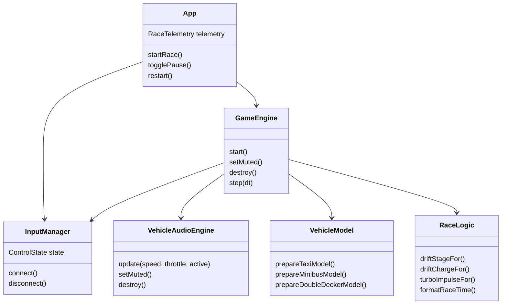
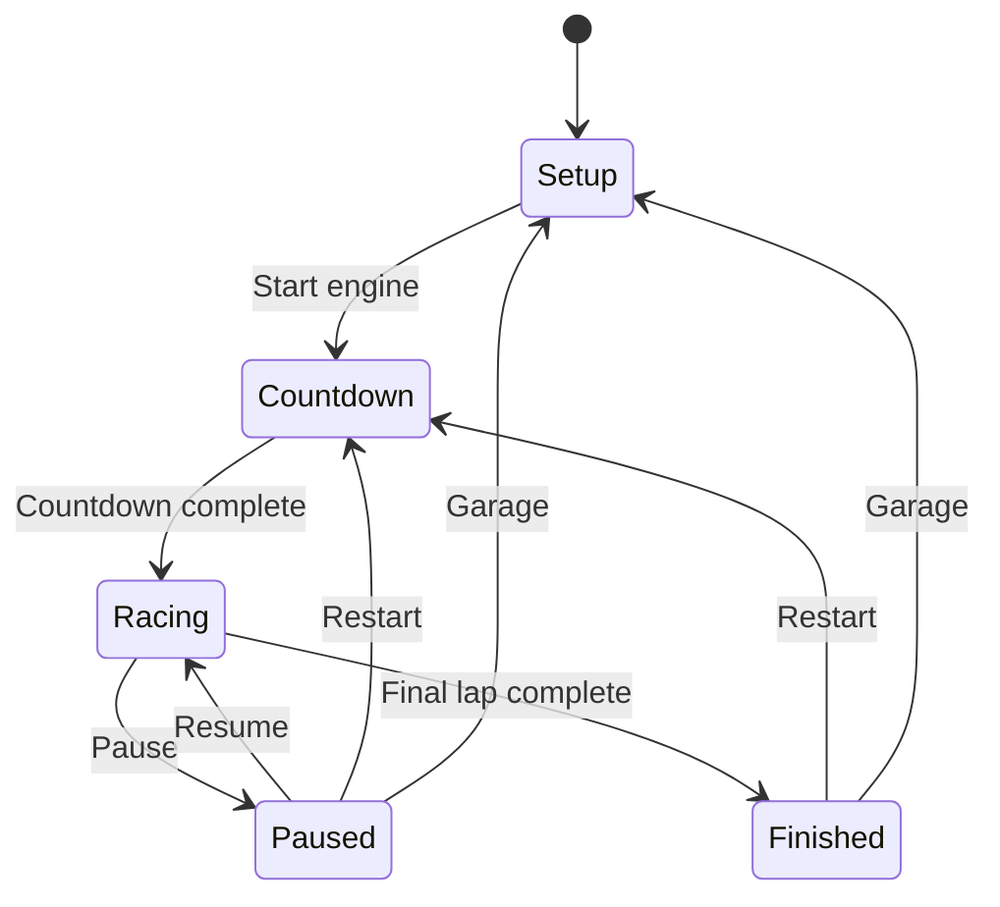
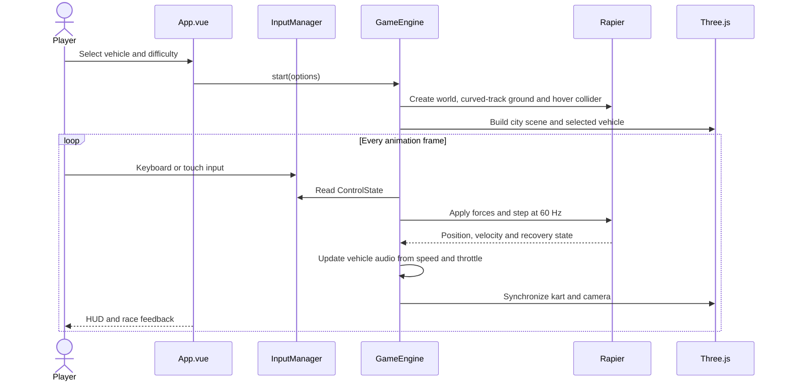
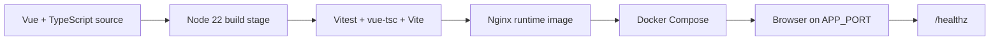

# Neon Drift Hong Kong

Neon Drift Hong Kong is a client-side Vue 3, Three.js and Rapier arcade racing prototype with two selectable courses: the two-lap **Mong Kok sprint** (`hongKongRoute`) and the five-lap **Neon Rift / 霓虹裂谷** street circuit (`neonRift`). Players select a local vehicle, race three AI rivals, drift to charge a mini-turbo, and on Neon Rift manage dynamic weather, aquaplaning puddles, kerbs and a blind viaduct crest.

The current Phase 1 implementation is a browser-only game. The FastAPI and Redis leaderboard described in the original GDD are future scope; no backend service or database is required today.

## Quick start

Requirements:

- Node.js 20+ and npm
- A modern browser with WebGL and WebAssembly
- Docker Desktop only for container build/deployment

```bash
# README.md
npm ci
npm run dev
```

Open [http://127.0.0.1:5173/](http://127.0.0.1:5173/), select a vehicle, licence class and circuit, then press **START ENGINE**. Keyboard controls are `W`/Arrow Up for acceleration, `A`/`D` or arrow keys for steering, `Space` for drift and `L` for headlights. Touch controls include a LIGHTS toggle on small screens.

## Program specification

### Runtime structure

| Path | Responsibility |
| --- | --- |
| `src/App.vue` | Setup screen, vehicle/difficulty/circuit selection, HUD (lap, checkpoints, standings, weather, grip), pause, finish and restart states |
| `src/types/game.ts` | Strict TypeScript contracts for vehicles, controls, telemetry, standings and `TrackDefinition` |
| `src/config/gameConfig.ts` | Immutable vehicle, difficulty and AI rival tuning |
| `src/config/trackConfig.ts`, `src/config/tracks/*.ts` | Circuit catalogue: Mong Kok sprint and Neon Rift track data |
| `src/game/InputManager.ts` | Keyboard and pointer/touch input boundary, including the `L` headlight toggle |
| `src/game/GameEngine.ts` | Rendering coordinator: scene, camera, interpolation, headlights, rain, tunnel audio blend and resize lifecycle |
| `src/game/RaceSimulation.ts` | Headless Rapier race: colliders, fixed-step physics for player and rivals, weather, surfaces, checkpoints, laps and standings |
| `src/game/weatherModel.ts` | Weather stages, racing-line grip, braking and aquaplaning rules |
| `src/game/vehicle/handlingModel.ts`, `VehicleController.ts` | Understeer yaw cap, crest unloading, spin and braking forces |
| `src/game/ai/aiDriver.ts`, `src/game/track/racingLine.ts` | AI steering, rubber-banding, racing line and target-speed profile |
| `src/game/propDebris.ts`, `src/game/scene/propField.ts` | Visual-only destructible barrels and signs |
| `src/game/themes/*.ts`, `src/game/scene/*.ts` | Per-track scenery, set pieces (holo brake wall, warning lamps, pillars, kerbs, puddles), street furniture and rain |
| `src/game/track/*.ts` | Arc-length spline, ribbon geometry, landmark features and JSON export |
| `docs/race_track.md`, `docs/track-data/*.json` | Neon Rift design brief and exported checkpoint/landmark coordinates (`npm run export:tracks`) |
| `src/game/VehicleAudioEngine.ts` | Web Audio MP3 loop, tunnel reverb, mute control and smoothed per-frame playback output |
| `src/game/audioModel.ts` | Pure speed, throttle, vehicle-class and tunnel-mix sample tuning |
| `src/game/audioModel.test.ts` | Vitest coverage for engine pitch, gain and inactive-race silence |
| `public/audio/small-car-engine2.mp3` | User-provided 20.304-second looping vehicle engine recording used during driving |
| `src/game/vehicleModel.ts` | Shared FBX normalization, scaling, grounding and heading logic |
| `src/game/physicsModel.ts` | Pure hover-force, visual smoothing and recovery calculations |
| `src/game/raceLogic.ts` | Pure drift, turbo, timing and leaderboard rules |
| `src/game/InputManager.test.ts` | Vitest coverage for headlight toggle and reset semantics |
| `src/components/VehicleIcon.vue` | Vehicle selection silhouettes |
| `src/styles.css` | Responsive setup screen, HUD and touch-control styling |
| `public/models/taxi/HK_Taxi_Red.fbx` | Embedded-texture red taxi model |
| `public/models/minibus/HK_Minibus_Red.fbx` | Embedded-texture red minibus model |
| `public/models/double-decker/HK_Doubledeck_002.fbx` | Embedded-texture double-decker model |
| `public/models/tram/HK_Tram.fbx` | Original supplied tram FBX source model |
| `public/models/tram/HK_Tram.glb` | Indexed runtime tram model optimized for browser loading |
| `scripts/convert-tram.mjs` | Reproducible FBX-to-GLB tram conversion and vertex indexing |
| `public/ads/adv1.jpeg` | User-provided VitaGreen roadside advertisement |
| `public/ads/adv2.jpeg` | User-provided Deliveroo anniversary roadside advertisement |
| `public/ads/adv3.jpeg` | User-provided Lion Ball cooking-oil roadside advertisement |
| `scripts/build.sh` | Locked dependency install, tests, Vite build and Docker image build |
| `scripts/deploy.sh` | Validated Docker Compose deployment and health polling |
| `Dockerfile` | Multi-stage Node build and Nginx runtime image |
| `compose.yaml` | Hardened single-service container runtime |
| `deployment/nginx.conf` | SPA fallback, asset caching, compression and `/healthz` |
| `docs/SPECIFICATION.md` | Detailed functional specification and test matrix |
| `hk_racing_car.md` | Original bilingual game design document |

### Component and class relationships



### Client contracts

Phase 1 has no public HTTP API. The public application contracts are the strict TypeScript types in `src/types/game.ts`:

- `VehicleId`: `taxi`, `minibus`, `doubleDecker`, `tram`
- `DifficultyId`: `learner`, `probationary`, `professional`
- `ControlState`: acceleration, braking, steering, drift and headlight inputs
- `RaceTelemetry`: phase, lap, speed, drift charge, turbo level, checkpoint, Seamless timer and `headlightsOn`
- `LeaderboardEntry`: display name, vehicle, race time and ranking data

Any future backend should expose typed DTOs and preserve these domain concepts rather than exposing database entities directly.

## Design specification

### Player experience

1. The player chooses one of four Hong Kong vehicles, one of three licence classes and one of two circuits.
2. The engine initializes the scene and physics world, places the player on a grid with three AI rivals, then shows a three-count start.
3. **Mong Kok sprint** runs two laps on a Kowloon-style open street with a gray-white road, wet patches, bilingual signs, shopfronts and rotating roadside advertising boards. **Neon Rift** runs five laps on a closed night circuit (see below).
4. Players accelerate, steer, drift and release a charged mini-turbo. Hidden checkpoints must be passed in order, so shortcuts never count.
5. A full-width chequered line marks the lap gate. Completing the final lap opens the results state with the finishing order.

### Neon Rift circuit (霓虹裂谷)

A roughly 1.6 km clockwise street circuit with 15 named corners, 12 hidden checkpoints and 5 laps, built from `docs/race_track.md`. A scripted lap in a taxi on Professional takes about 74 s.

**Look and sound**

- Dark wet asphalt with magenta and cyan edge lines, glass barrier walls, neon arches every 160 m and a canyon of lit towers descending to a city floor 14 m below the road.
- Elevation changes: the road drops about 7 m into a covered aqueduct tunnel, then climbs about 12 m to the harbour viaduct, which stands on lit pillars.
- Inside the tunnel (s ≈ 705–955 m) the engine gets louder and gains reverb; it snaps back to a clean mix on exit.
- Heavy rain streaks and denser fog during the storm stage.

**Key corners**

| Corner | Effect on driving |
| --- | --- |
| Turn 3 財閥廣場 (Tycoon Plaza), right-angle right | A 22 m holographic board sits straight ahead. It turns into a red warning when your current speed means you must brake now, adjusted for the weather's braking grip. Overshooting sends you into the glass wall, which absorbs speed (low bounce, low friction). Towers keep a 30 m clear plaza around the board so it stays visible. |
| Turns 7–9 地下水道 (aqueduct chicane), inside the tunnel | Blinking amber warning lamps line both sides and the kerbs glow. Kerbs give slightly less grip (92% dry, 80% when wet), so cutting them trades grip for a shorter line. A bad entry leaves you understeering into the walls. |
| Turn 14 跨港大橋 (harbour viaduct), blind crest | Three reference pillars on the left; the second one glows blue as the turn-in marker. Over the crest the suspension unloads and grip falls by up to 65%. Steering too hard there can trigger a 0.9 s spin. |

**Dynamic weather** (the race leader's distance sets the sky for everyone)

| Stage | When | Effect |
| --- | --- | --- |
| Damp | Laps 1–2 | Full grip and normal braking; the road looks lightly wet |
| Storm | From about 535 m into lap 3 | Grip drops to 65%, braking deceleration to 83% (about 20% longer stopping distance). Driving through a puddle above 28 m/s (about 100 km/h) causes aquaplaning, with grip at 10% |
| Drying | Laps 4–5 | Grip on the racing line recovers gradually to 100%. Off the line it stays at 72–80%. Puddles stop causing aquaplaning once the track is 35% dry |

**Handling, rivals and props**

- Cornering is capped by grip and speed, so low grip or high speed makes the car understeer instead of turning on the spot. Drifting raises the cap by 60%.
- Three AI rivals (夜更阿明, KOWLOON KID, 港島速遞) follow a computed racing line and brake for each bend using a speed profile that reacts to the weather's grip. They never share your vehicle. They get up to 6% faster when behind you and slower when ahead. A rival stuck for 2.5 s is recovered automatically.
- Barrels and signs at the Turn 3, chicane and Turn 14 exits scatter when hit. They are visual only and don't cost you speed.
- The HUD shows weather, surface grip %, aquaplaning and spin warnings, and live standings with gaps.
- Checkpoint and landmark coordinates are exported to `docs/track-data/neonRift.json` for a future operations map.

**Differences from the design brief** (`docs/race_track.md`): the brief calls for a 5.8 km track, a lap time of about 1:42 and a 1.2 km viaduct straight. The current layout is a 1.6 km prototype, and there's no tyre choice yet.

### Vehicle roster

| Vehicle | Archetype | Implemented tuning |
| --- | --- | --- |
| 的士 / Red Taxi | Speed Demon | Highest speed, low grip, embedded FBX model |
| 小巴 / Red Minibus | The Brawler | Medium-heavy handling, embedded FBX model |
| 雙層巴士 / Double-Decker | Juggernaut | Heavy handling, embedded FBX model |
| 電車 / Tram | Tracked Wall | Supplied FBX model with procedural fallback |

The taxi, minibus and double-decker FBX files and the optimized tram GLB are loaded only for their selected vehicle. Each model is normalized without modifying its loader axis conversion: it is scaled to the vehicle class length, centered, grounded at `y = 0`, and wrapped with a world-space heading group. The original 20MB tram FBX is retained as a source asset and converted with `npm run convert:tram`; the conversion indexes the mesh and embeds four optimized source textures in a roughly 12MB runtime GLB. Running the conversion requires `ffmpeg`, but normal development and production builds use the committed GLB and do not require it. If a model request fails, the matching procedural vehicle remains playable.

### Driving model

- Rapier uses a dynamic hover-sphere collider and a fixed `1/60` second timestep.
- The track centerline follows a smooth multi-frequency S-curve; road segments, lane markings, barriers, buildings, shopfronts, ads and overhead signs share the same sampled centerline and heading.
- A high-resolution 12-by-2 chequered finish texture spans the road at the lap boundary and follows the local curve heading; lap detection uses the same angled line normal.
- A downward raycast applies mass-scaled hover force and spring/damping correction.
- Acceleration is applied along the kart heading and lateral force models grip.
- The browser frame delta is capped at `80 ms` to prevent large simulation jumps.
- Drift requires steering input and forward speed above `4 m/s`.
- Drift stages charge at `650 ms`, `1500 ms` and `2400 ms`; release applies the corresponding turbo impulse.
- The cyan Seamless decal refreshes a five-second low-friction buff.
- Static building colliders use low friction and high restitution so a façade impact produces a rebound while preserving momentum.
- Each vehicle has two front SpotLights. `L` and the mobile LIGHTS button toggle them, while per-frame targets track the vehicle's current heading.
- Each race loops the supplied engine MP3 through a filtered Web Audio graph. Speed and throttle raise playback rate and volume, heavier vehicles start at a lower rate, and pause or finish fades the sample to silence.
- The HUD speaker control mutes and unmutes the live vehicle sound without changing race state.
- Three supplied advertisements are loaded uncropped at their original aspect ratios on track-facing boards. Each side gets a fresh shuffled sequence per race; every board has a warm point light for night readability.
- Out-of-bounds or invalid physics positions reset to the start transform and zero velocity.

### State model



### UI and responsive design

- Dark, high-contrast arcade presentation with muted surfaces and yellow/red/teal accents.
- Desktop HUD shows position, lap, race time, leaderboard, speed, mini-turbo and keyboard hints.
- Mobile HUD reduces the leaderboard to nearby rivals and keeps touch controls inside safe-area insets.
- Canvas rendering is full-screen; Vue owns setup and overlay state while Three.js owns the scene.
- Keyboard listeners, pointer listeners, resize listeners, animation frames and timers are released during teardown.

### End-to-end flow



## Deployment specification

### Topology



The production container uses Node `22.19.0-alpine3.22` for the build stage and Nginx `1.29.1-alpine3.22` for static serving. Nginx listens on container port `8080`; Compose publishes it to the host.

### Environment variables

| Variable | Default | Purpose |
| --- | --- | --- |
| `IMAGE_REPOSITORY` | `neon-drift-hk` | Container image name |
| `IMAGE_TAG` | `latest` | Container image tag |
| `CONTAINER_NAME` | `neon-drift-hk` | Container name |
| `APP_PORT` | `8080` | Host port published by Compose |
| `COMPOSE_PROJECT_NAME` | `neon-drift-hk` | Compose resource namespace |
| `HEALTH_RETRIES` | `30` | One-second health-check attempts |

There are no database URLs, API keys or secrets in Phase 1. No connection pool is required because the game is client-only.

### Local development

```bash
# README.md
npm ci
npm run dev
npm run test
npm run build
```

### Container build

```bash
# README.md
npm run build:image
```

The build script runs `npm ci`, Vitest, the TypeScript/Vite production build, and `docker build`. The Dockerfile copies `public/models` and `public/ads`, so the FBX vehicle assets and supplied advertisement textures are included in the image.

### Local deployment

```bash
# README.md
npm run deploy
```

`deploy.sh` validates the port and retry count, verifies Docker availability, rebuilds the image from the current source (set `SKIP_BUILD=1` to redeploy the existing image unchanged), starts Compose with `--force-recreate`, and polls:

```text
GET http://127.0.0.1:${APP_PORT}/healthz
```

Nginx provides SPA history fallback, immutable caching for hashed `/assets/`, gzip compression for JavaScript/CSS/WASM, security headers, and the plain-text health endpoint.

For a versioned deployment:

```bash
# README.md
IMAGE_REPOSITORY=registry.example.com/neon-drift-hk IMAGE_TAG=1.0.0 npm run build:image
IMAGE_REPOSITORY=registry.example.com/neon-drift-hk IMAGE_TAG=1.0.0 APP_PORT=8088 npm run deploy
```

## Testing specification

Run the full suite with:

```bash
# README.md
npm run test
```

Current automated coverage includes:

- Drift stage thresholds, charge capping and turbo scaling
- Race-time formatting and immutable leaderboard sorting
- Mass-scaled hover force and sustained forward motion
- Track-volume recovery and fixed-step physics behavior
- Taxi, minibus, double-decker and tram model normalization, grounding and scale contracts
- Vehicle sample playback rate, throttle gain, heavy-vehicle profile, tunnel mix and inactive-race silence
- Track spline maths, checkpoint ordering, anti-shortcut laps and track catalogue integrity
- Weather stages, racing-line grip, storm braking and aquaplaning thresholds
- Understeer yaw cap, crest unloading and spin triggering
- AI steering, rubber-banding, racing line, standings ordering and prop debris
- Scripted full laps of both circuits, plus three rivals completing a clean storm lap on Neon Rift
- Production type-check and Vite build through `npm run build`

The current suite does not require a database or external API. Browser-level WebGL assertions and a Redis-backed leaderboard integration suite are planned for a later phase.

## Operational notes

- If WebGL or WebAssembly initialization fails, reload in a browser with WebGL2/WASM enabled.
- If a 3D asset request fails, the game intentionally falls back to its procedural vehicle visual.
- Large Vite chunk warnings are expected because Three.js, Rapier and the loaders are bundled in Phase 1.
- The original design goals and future hazards/items remain documented in [hk_racing_car.md](hk_racing_car.md); the implemented Phase 1 behavior is documented in [docs/SPECIFICATION.md](docs/SPECIFICATION.md).
