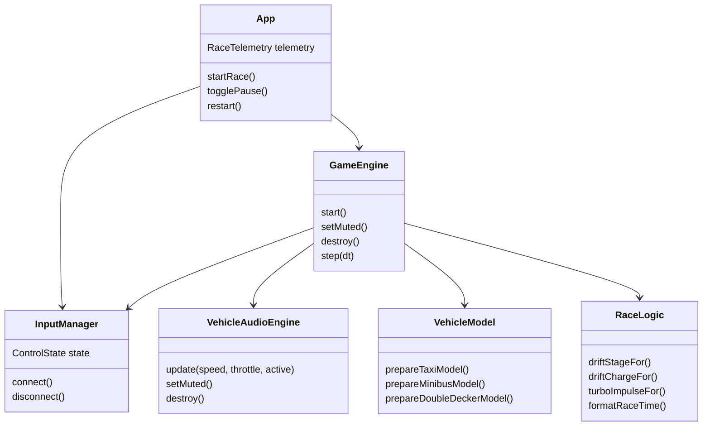
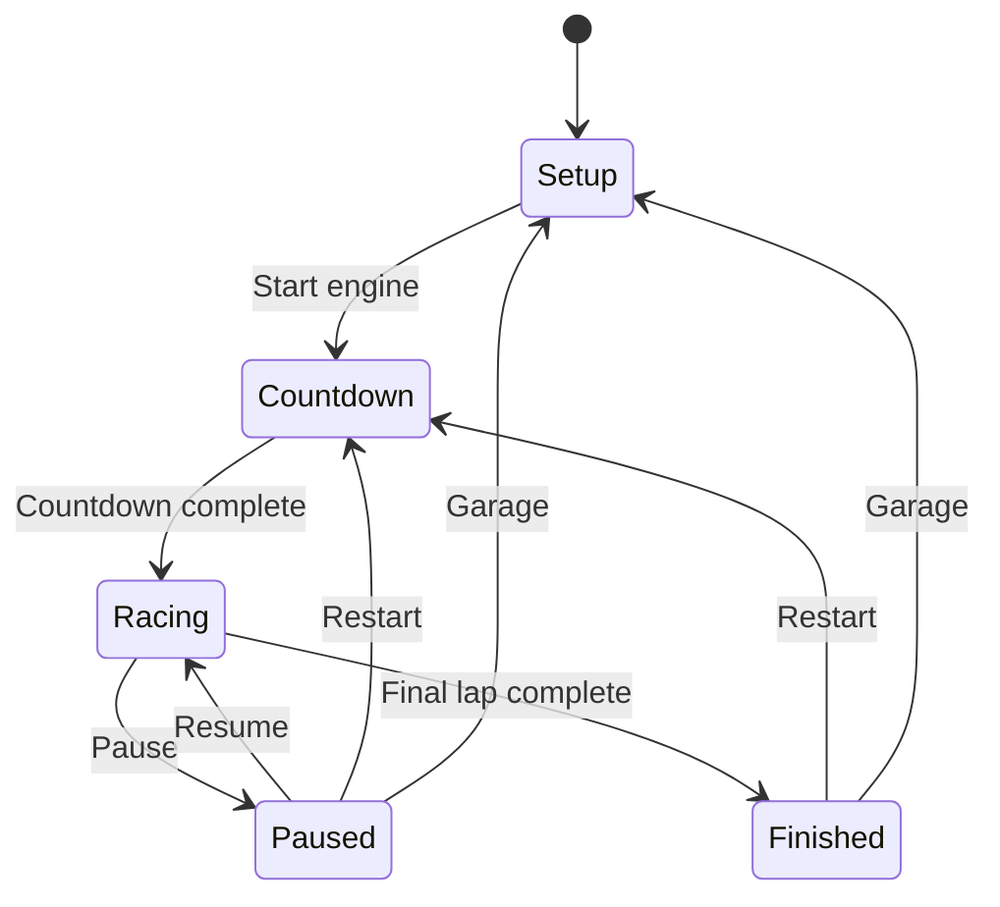
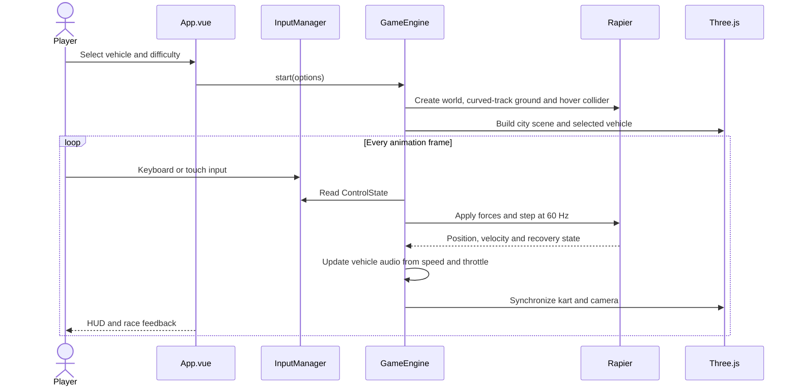
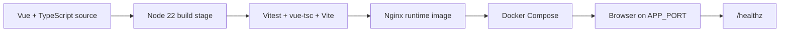

# Neon Drift Hong Kong

Neon Drift Hong Kong is a client-side Vue 3, Three.js and Rapier arcade racing prototype set on a neon-lit Hong Kong street circuit. Players select a local vehicle, race through two laps, drift to charge a mini-turbo, and drive through a Seamless water decal that reduces lateral friction.

The current Phase 1 implementation is a browser-only game. The FastAPI and Redis leaderboard described in the original GDD are future scope; no backend service or database is required today.

## Quick start

Requirements:

- Node.js 20+ and npm
- A modern browser with WebGL and WebAssembly
- Docker Desktop only for container build/deployment

```bash
# README.md
npm ci
npm run dev
```

Open [http://127.0.0.1:5173/](http://127.0.0.1:5173/), select a vehicle and licence class, then press **START ENGINE**. Keyboard controls are `W`/Arrow Up for acceleration, `A`/`D` or arrow keys for steering, `Space` for drift and `L` for headlights. Touch controls include a LIGHTS toggle on small screens.

## Program specification

### Runtime structure

| Path | Responsibility |
| --- | --- |
| `src/App.vue` | Setup screen, vehicle/difficulty selection, HUD, pause, finish and restart states |
| `src/types/game.ts` | Strict TypeScript contracts for vehicles, controls, telemetry and race state |
| `src/config/gameConfig.ts` | Immutable vehicle and difficulty tuning |
| `src/game/InputManager.ts` | Keyboard and pointer/touch input boundary, including the `L` headlight toggle |
| `src/game/GameEngine.ts` | Three.js scene, FBX loading, Rapier physics, building momentum collisions, tracked SpotLights, fixed-step loop and race lifecycle |
| `src/game/VehicleAudioEngine.ts` | Web Audio MP3 loop, mute control and smoothed per-frame playback output |
| `src/game/audioModel.ts` | Pure speed, throttle and vehicle-class sample rate/gain tuning |
| `src/game/audioModel.test.ts` | Vitest coverage for engine pitch, gain and inactive-race silence |
| `public/audio/small-car-engine2.mp3` | User-provided 20.304-second looping vehicle engine recording used during driving |
| `src/game/vehicleModel.ts` | Shared FBX normalization, scaling, grounding and heading logic |
| `src/game/physicsModel.ts` | Pure hover-force, visual smoothing and recovery calculations |
| `src/game/raceLogic.ts` | Pure drift, turbo, timing and leaderboard rules |
| `src/game/InputManager.test.ts` | Vitest coverage for headlight toggle and reset semantics |
| `src/components/VehicleIcon.vue` | Vehicle selection silhouettes |
| `src/styles.css` | Responsive setup screen, HUD and touch-control styling |
| `public/models/taxi/HK_Taxi_Red.fbx` | Embedded-texture red taxi model |
| `public/models/minibus/HK_Minibus_Red.fbx` | Embedded-texture red minibus model |
| `public/models/double-decker/HK_Doubledeck_002.fbx` | Embedded-texture double-decker model |
| `public/models/tram/HK_Tram.fbx` | Original supplied tram FBX source model |
| `public/models/tram/HK_Tram.glb` | Indexed runtime tram model optimized for browser loading |
| `scripts/convert-tram.mjs` | Reproducible FBX-to-GLB tram conversion and vertex indexing |
| `public/ads/adv1.jpeg` | User-provided VitaGreen roadside advertisement |
| `public/ads/adv2.jpeg` | User-provided Deliveroo anniversary roadside advertisement |
| `public/ads/adv3.jpeg` | User-provided Lion Ball cooking-oil roadside advertisement |
| `scripts/build.sh` | Locked dependency install, tests, Vite build and Docker image build |
| `scripts/deploy.sh` | Validated Docker Compose deployment and health polling |
| `Dockerfile` | Multi-stage Node build and Nginx runtime image |
| `compose.yaml` | Hardened single-service container runtime |
| `deployment/nginx.conf` | SPA fallback, asset caching, compression and `/healthz` |
| `docs/SPECIFICATION.md` | Detailed functional specification and test matrix |
| `hk_racing_car.md` | Original bilingual game design document |

### Component and class relationships



### Client contracts

Phase 1 has no public HTTP API. The public application contracts are the strict TypeScript types in `src/types/game.ts`:

- `VehicleId`: `taxi`, `minibus`, `doubleDecker`, `tram`
- `DifficultyId`: `learner`, `probationary`, `professional`
- `ControlState`: acceleration, braking, steering, drift and headlight inputs
- `RaceTelemetry`: phase, lap, speed, drift charge, turbo level, checkpoint, Seamless timer and `headlightsOn`
- `LeaderboardEntry`: display name, vehicle, race time and ranking data

Any future backend should expose typed DTOs and preserve these domain concepts rather than exposing database entities directly.

## Design specification

### Player experience

1. The player chooses one of four Hong Kong vehicles and one of three licence classes.
2. The engine initializes the scene and physics world, then shows a three-countdown start.
3. The race runs for two laps on a neon Kowloon-style street track with a gray-white road, wet road patches, bilingual signs, shopfronts, building windows and rotating user-provided roadside advertising boards.
4. Players accelerate, steer, drift and release a charged mini-turbo.
5. A full-width black-and-white chequered line marks the physical lap trigger. Crossing it advances the lap; completing the final lap opens the results state.

### Vehicle roster

| Vehicle | Archetype | Implemented tuning |
| --- | --- | --- |
| 的士 / Red Taxi | Speed Demon | Highest speed, low grip, embedded FBX model |
| 小巴 / Red Minibus | The Brawler | Medium-heavy handling, embedded FBX model |
| 雙層巴士 / Double-Decker | Juggernaut | Heavy handling, embedded FBX model |
| 電車 / Tram | Tracked Wall | Supplied FBX model with procedural fallback |

The taxi, minibus and double-decker FBX files and the optimized tram GLB are loaded only for their selected vehicle. Each model is normalized without modifying its loader axis conversion: it is scaled to the vehicle class length, centered, grounded at `y = 0`, and wrapped with a world-space heading group. The original 20MB tram FBX is retained as a source asset and converted with `npm run convert:tram`; the conversion indexes the mesh and embeds four optimized source textures in a roughly 12MB runtime GLB. Running the conversion requires `ffmpeg`, but normal development and production builds use the committed GLB and do not require it. If a model request fails, the matching procedural vehicle remains playable.

### Driving model

- Rapier uses a dynamic hover-sphere collider and a fixed `1/60` second timestep.
- The track centerline follows a smooth multi-frequency S-curve; road segments, lane markings, barriers, buildings, shopfronts, ads and overhead signs share the same sampled centerline and heading.
- A high-resolution 12-by-2 chequered finish texture spans the road at the lap boundary and follows the local curve heading; lap detection uses the same angled line normal.
- A downward raycast applies mass-scaled hover force and spring/damping correction.
- Acceleration is applied along the kart heading and lateral force models grip.
- The browser frame delta is capped at `80 ms` to prevent large simulation jumps.
- Drift requires steering input and forward speed above `4 m/s`.
- Drift stages charge at `650 ms`, `1500 ms` and `2400 ms`; release applies the corresponding turbo impulse.
- The cyan Seamless decal refreshes a five-second low-friction buff.
- Static building colliders use low friction and high restitution so a façade impact produces a rebound while preserving momentum.
- Each vehicle has two front SpotLights. `L` and the mobile LIGHTS button toggle them, while per-frame targets track the vehicle's current heading.
- Each race loops the supplied engine MP3 through a filtered Web Audio graph. Speed and throttle raise playback rate and volume, heavier vehicles start at a lower rate, and pause or finish fades the sample to silence.
- The HUD speaker control mutes and unmutes the live vehicle sound without changing race state.
- Three supplied advertisements are loaded uncropped at their original aspect ratios on track-facing boards. Each side gets a fresh shuffled sequence per race; every board has a warm point light for night readability.
- Out-of-bounds or invalid physics positions reset to the start transform and zero velocity.

### State model



### UI and responsive design

- Dark, high-contrast arcade presentation with muted surfaces and yellow/red/teal accents.
- Desktop HUD shows position, lap, race time, leaderboard, speed, mini-turbo and keyboard hints.
- Mobile HUD reduces the leaderboard to nearby rivals and keeps touch controls inside safe-area insets.
- Canvas rendering is full-screen; Vue owns setup and overlay state while Three.js owns the scene.
- Keyboard listeners, pointer listeners, resize listeners, animation frames and timers are released during teardown.

### End-to-end flow



## Deployment specification

### Topology



The production container uses Node `22.19.0-alpine3.22` for the build stage and Nginx `1.29.1-alpine3.22` for static serving. Nginx listens on container port `8080`; Compose publishes it to the host.

### Environment variables

| Variable | Default | Purpose |
| --- | --- | --- |
| `IMAGE_REPOSITORY` | `neon-drift-hk` | Container image name |
| `IMAGE_TAG` | `latest` | Container image tag |
| `CONTAINER_NAME` | `neon-drift-hk` | Container name |
| `APP_PORT` | `8080` | Host port published by Compose |
| `COMPOSE_PROJECT_NAME` | `neon-drift-hk` | Compose resource namespace |
| `HEALTH_RETRIES` | `30` | One-second health-check attempts |

There are no database URLs, API keys or secrets in Phase 1. No connection pool is required because the game is client-only.

### Local development

```bash
# README.md
npm ci
npm run dev
npm run test
npm run build
```

### Container build

```bash
# README.md
npm run build:image
```

The build script runs `npm ci`, Vitest, the TypeScript/Vite production build, and `docker build`. The Dockerfile copies `public/models` and `public/ads`, so the FBX vehicle assets and supplied advertisement textures are included in the image.

### Local deployment

```bash
# README.md
npm run deploy
```

`deploy.sh` validates the port and retry count, verifies Docker availability, builds a missing image, starts Compose with `--force-recreate`, and polls:

```text
GET http://127.0.0.1:${APP_PORT}/healthz
```

Nginx provides SPA history fallback, immutable caching for hashed `/assets/`, gzip compression for JavaScript/CSS/WASM, security headers, and the plain-text health endpoint.

For a versioned deployment:

```bash
# README.md
IMAGE_REPOSITORY=registry.example.com/neon-drift-hk IMAGE_TAG=1.0.0 npm run build:image
IMAGE_REPOSITORY=registry.example.com/neon-drift-hk IMAGE_TAG=1.0.0 APP_PORT=8088 npm run deploy
```

## Testing specification

Run the full suite with:

```bash
# README.md
npm run test
```

Current automated coverage includes:

- Drift stage thresholds, charge capping and turbo scaling
- Race-time formatting and immutable leaderboard sorting
- Mass-scaled hover force and sustained forward motion
- Track-volume recovery and fixed-step physics behavior
- Taxi, minibus, double-decker and tram model normalization, grounding and scale contracts
- Vehicle sample playback rate, throttle gain, heavy-vehicle profile and inactive-race silence
- Production type-check and Vite build through `npm run build`

The current suite does not require a database or external API. Browser-level WebGL assertions and a Redis-backed leaderboard integration suite are planned for a later phase.

## Operational notes

- If WebGL or WebAssembly initialization fails, reload in a browser with WebGL2/WASM enabled.
- If a 3D asset request fails, the game intentionally falls back to its procedural vehicle visual.
- Large Vite chunk warnings are expected because Three.js, Rapier and the loaders are bundled in Phase 1.
- The original design goals and future hazards/items remain documented in [hk_racing_car.md](hk_racing_car.md); the implemented Phase 1 behavior is documented in [docs/SPECIFICATION.md](docs/SPECIFICATION.md).
