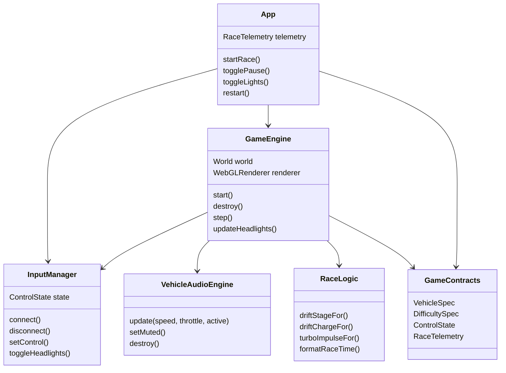
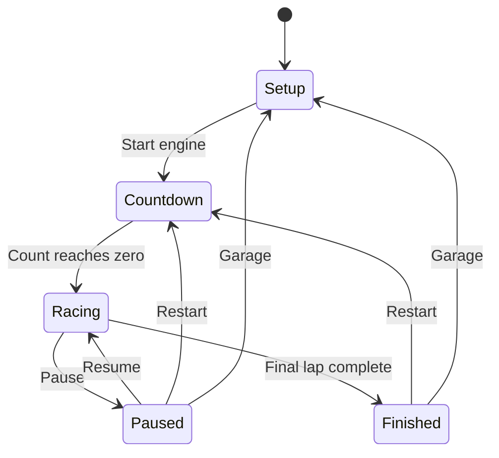
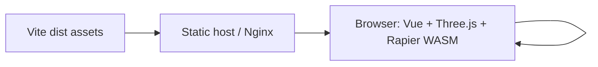
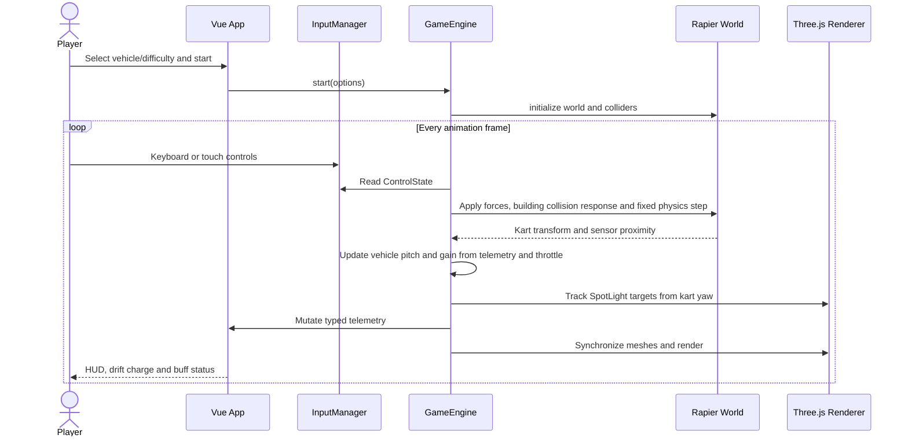

# Neon Drift Hong Kong Phase 1 Specifications

## Program Specification

### Structure

| Path | Responsibility |
| --- | --- |
| `src/App.vue` | Race setup, HUD, touch controls, pause and completion presentation |
| `src/types/game.ts` | Public game-state, vehicle, difficulty and leaderboard contracts |
| `src/config/gameConfig.ts` | Immutable vehicle and difficulty tuning data |
| `src/game/InputManager.ts` | Keyboard and touch input boundary, including persistent headlight toggle state |
| `src/game/GameEngine.ts` | Three.js scene, Rapier world, building collision momentum, tracked headlights, fixed-step simulation and race lifecycle |
| `src/game/VehicleAudioEngine.ts` | Web Audio MP3 graph lifecycle, smoothed playback updates and mute state |
| `src/game/audioModel.ts` | Pure vehicle-class playback-rate and gain calculation from speed, throttle and race activity |
| `src/game/audioModel.test.ts` | Vitest unit coverage for vehicle sound behavior |
| `public/audio/small-car-engine2.mp3` | User-provided 20.304-second looping vehicle engine sample used during driving |
| `public/models/taxi/HK_Taxi_Red.fbx` | Runtime FBX visual model for the playable red taxi |
| `public/models/minibus/HK_Minibus_Red.fbx` | Runtime FBX visual model with embedded textures for the playable red minibus |
| `public/models/double-decker/HK_Doubledeck_002.fbx` | Runtime FBX visual model with embedded textures for the playable double-decker bus |
| `public/models/tram/HK_Tram.fbx` | Original supplied tram FBX source model |
| `public/models/tram/HK_Tram.glb` | Indexed runtime tram asset optimized for GLTFLoader |
| `scripts/convert-tram.mjs` | Reproducible source conversion from the supplied FBX to runtime GLB |
| `public/ads/adv1.jpeg` | User-provided VitaGreen roadside advertisement texture |
| `public/ads/adv2.jpeg` | User-provided Deliveroo roadside advertisement texture |
| `public/ads/adv3.jpeg` | User-provided Lion Ball roadside advertisement texture |
| `src/game/physicsModel.ts` | Pure hover-force, track-volume recovery and sustained-drive model |
| `src/game/raceLogic.ts` | Pure drift, timing and ranking domain functions |
| `src/components/VehicleIcon.vue` | Reusable vehicle-class silhouette |
| `src/styles.css` | Responsive setup, HUD and touch-control presentation |
| `src/game/raceLogic.test.ts` | Vitest unit coverage for pure race rules |
| `src/game/physicsModel.test.ts` | Vitest smoke coverage for gravity compensation, sustained drive and recovery |
| `src/game/hoverPhysics.integration.test.ts` | Rapier integration coverage for stable hover and momentum-preserving building impacts |
| `src/game/hoverPhysics.integration.test.ts` | Rapier integration coverage for stable hover and momentum-preserving building impacts |
| `src/game/InputManager.test.ts` | Vitest coverage for headlight toggling and input reset semantics |
| `Dockerfile` | Reproducible Node build and minimal Nginx runtime image |
| `compose.yaml` | Hardened single-service runtime and health-check contract |
| `deployment/nginx.conf` | SPA fallback, immutable asset caching, WASM compression and health endpoint |
| `scripts/build.sh` | Locked install, tests, application build and container image build |
| `scripts/deploy.sh` | Validated Compose deployment with bounded readiness polling and diagnostics |

### Component Dependencies



### Public Contracts

Phase 1 is a client-only prototype and exposes no HTTP endpoints. Its public contracts are the TypeScript interfaces in `src/types/game.ts`. A future leaderboard backend should preserve `LeaderboardEntry` and wrap responses in a typed envelope with `code`, `message`, `data`, and `timestamp`.

## Functional Specification

### Race Flow

1. The player selects one of four vehicle specifications and one of three difficulty specifications.
2. Starting a race creates the Three.js scene and Rapier world, then runs a three-count countdown.
3. When the red taxi, red minibus or double-decker is selected, the engine loads its matching FBX. The tram loads an indexed GLB generated from the supplied 20MB FBX because parsing its 759,009 unindexed vertices and four 4096px embedded images at race start stalls the browser. The conversion retains those four textures at a game-appropriate resolution in a single roughly 12MB GLB. Every format is normalized for orientation, scale, center and ground position. A loading failure falls back to the matching procedural vehicle without blocking the race.
4. During racing, `requestAnimationFrame` gathers elapsed time and advances Rapier at a fixed 60 Hz step. The road follows a smooth sampled S-curve; surrounding geometry and lane markings use the same centerline so visual and physical track framing stay aligned.
5. Acceleration acts along kart heading, steering changes yaw, and lateral forces model grip.
6. Holding drift while steering above the minimum speed hops once and accumulates charge. Releasing applies the impulse assigned to the achieved drift stage.
7. Entering the fluorescent decal radius refreshes the Seamless timer to five seconds and minimizes lateral friction.
8. Building façades are represented by static Rapier cuboids with low friction and high restitution. Impacts therefore preserve horizontal momentum and rebound the selected vehicle instead of allowing it to pass through the city wall.
9. Every vehicle receives two front SpotLights. Pressing `L`, or the mobile LIGHTS control, toggles both lights. Their targets are updated each frame from the vehicle position and yaw so the beam follows steering.
10. The three supplied advertising textures are loaded before the race begins and placed on both roadside facades. Landscape and portrait source ratios are preserved, board order is freshly shuffled per side, and each board receives a warm point light.
11. A black-and-white 12-by-2 chequered ground marking spans the curved road at the finish plane. Crossing it resets the kart for the next lap; completing two laps transitions to the finished state.
12. Starting the race creates a filtered browser Web Audio graph and begins looping the supplied engine MP3 at zero race gain. Each rendered frame maps current speed and throttle to smoothed playback-rate and gain values, with lower base rates for heavier vehicles. Countdown, pause and finish states target zero gain, while the HUD speaker button controls the master gain.

### Validation and Boundaries

| Boundary | Rule |
| --- | --- |
| Vehicle selection | Must be one of `taxi`, `minibus`, `doubleDecker`, `tram` |
| Difficulty selection | Must be one of `learner`, `probationary`, `professional` |
| Physics frame | Browser frame delta is capped at 80 ms; simulation advances in 1/60-second increments |
| Speed display | Clamped to the HUD contract range of 0-200 km/h |
| Drift | Requires steering input and absolute forward speed above 4 m/s |
| Drift charge | Capped at 100; stage thresholds are 650, 1500 and 2400 ms |
| Seamless buff | Never negative; re-entering the sensor refreshes duration to 5000 ms |
| Input cleanup | Keyboard listeners, animation frame, resize listener and countdown timer are released on teardown |
| Headlights | `L` toggles both front SpotLights; the mobile LIGHTS button exposes the same state and telemetry reflects `headlightsOn` |
| Building collision | Static building colliders use restitution and low friction so impacts rebound with momentum; out-of-bounds recovery remains reserved for leaving the track volume |
| Road palette | Road and wet patches use a gray-white material palette for visibility against the night city |
| Track geometry | `trackCenterX`, `trackHeadingAt` and `trackPointAt` define the shared curved centerline used by road, markings and roadside props |
| Finish line | The visual chequered line and lap trigger share `FINISH_LINE_Z`; `hasCrossedTrackLine` projects the kart onto the local curve normal so angled crossings match the marking |
| Advertising assets | `adv1.jpeg`, `adv2.jpeg` and `adv3.jpeg` are loaded from `/ads/`, preserve source aspect ratio and render uncropped on the track-facing face of illuminated boards |
| Vehicle audio | The supplied MP3 loops continuously; speed is clamped to the 0-180 km/h sound model range; non-racing phases output zero sample gain; mute changes only the master gain |

### State Transitions



### Error Recovery

WebGL or WASM initialization failures reject `GameEngine.start()` and remain visible in the browser console during Phase 1. Normal user recovery is a page reload. The physics controller restores the kart to the last race reset point if it leaves the supported track volume. A production phase should add a typed initialization-error state and a non-WebGL compatibility screen.

## Infrastructure and Deployment Topology

### Runtime

- Node.js 20 or newer; verified with Node.js 26.
- npm 11 or newer.
- Modern browser with WebGL2 and WebAssembly.
- `ffmpeg` is needed only when regenerating the optimized tram GLB with `npm run convert:tram`.
- Production output is emitted to `dist/` by Vite.
- No database or connection pool is used in Phase 1. Redis leaderboard integration remains future scope.
- No secrets are required. Deployment variables are optional and validated by the scripts.

| Variable | Default | Purpose |
| --- | --- | --- |
| `IMAGE_REPOSITORY` | `neon-drift-hk` | Local or registry-backed container repository |
| `IMAGE_TAG` | `latest` | Container image version |
| `CONTAINER_NAME` | `neon-drift-hk` | Runtime container name |
| `APP_PORT` | `8080` | Published host port |
| `COMPOSE_PROJECT_NAME` | `neon-drift-hk` | Isolates Compose-managed resources |
| `HEALTH_RETRIES` | `30` | One-second readiness attempts before deployment failure |



### Build and Deploy

Build and validate both the SPA and its image:

```bash
npm run build:image
```

Deploy locally and wait for the Nginx health endpoint:

```bash
npm run deploy
```

Deploy an explicitly versioned image on another port:

```bash
IMAGE_REPOSITORY=registry.example.com/neon-drift-hk IMAGE_TAG=1.0.0 APP_PORT=8088 npm run build:image
IMAGE_REPOSITORY=registry.example.com/neon-drift-hk IMAGE_TAG=1.0.0 APP_PORT=8088 npm run deploy
```

Nginx serves hashed Vite assets with immutable one-year caching, prevents caching of the SPA entry point, exposes `/healthz`, provides history fallback, and includes the standard `application/wasm` MIME mapping required by Rapier.

## End-to-End Sequence



## Testing Document

### Unit Tests

Vitest tests use Arrange-Act-Assert semantics and exercise domain functions independently from WebGL. Current coverage includes all drift stage boundaries, charge capping, turbo scaling, time formatting, immutable leaderboard sorting, mass-scaled gravity compensation, sustained 15-second forward motion, track-volume recovery, headlight input state transitions and vehicle audio pitch/gain rules.

Run:

```bash
npm run test
```

### Functional and Integration Test Matrix

| Test Case ID | Scenario | Preconditions | Input Payload | Expected Status & Response | Pass/Fail Criteria |
| --- | --- | --- | --- | --- | --- |
| UNIT-001 | Drift thresholds | Test runtime available | 0, 650, 1500, 2400 ms | Stages 0, 1, 2, 3 | Exact threshold assertions pass |
| UNIT-002 | Drift cap and boost | Test runtime available | 5000 ms, stages 2 and 3 | Charge 100; stage 3 impulse greater | Assertions pass |
| UNIT-003 | Race formatting/ranking | Unsorted entries | 65430 ms and two times | `1:05.43`; lower time first | Assertions pass without mutating input |
| UNIT-004 | Headlight input state | New InputManager | Toggle then reset | Headlight state toggles and survives transient input reset | Assertions pass |
| UNIT-005 | Vehicle sound mapping | Test runtime available | Vehicle, speed, throttle and race-active state | Driving raises sample rate/gain; heavy vehicles use a lower base rate; inactive race is silent | Exact playback-rate and gain relationships pass |
| FUNC-001 | Start default race | Setup visible | Taxi, Probationary | Countdown then active HUD | Canvas renders; phase becomes racing |
| FUNC-002 | Vehicle tuning | Setup visible | Each vehicle option | Stats and kart form update | Selected contract reaches engine |
| FUNC-003 | Accelerate and steer | Race active | W plus A/D | Speed rises and heading changes | HUD and kart movement respond |
| FUNC-004 | Drift mini-turbo | Moving above 4 m/s | Space plus turn, then release | Hop, charge, stronger release impulse | Stage and speed feedback observable |
| FUNC-005 | Seamless decal | Race active near decal | Drive through cyan sensor | Buff shows 5.0 seconds and counts down | Timer is visible and friction reduced |
| FUNC-006 | Pause/resume | Race active | Pause then Resume | Simulation and timer stop, then continue | No input remains stuck |
| FUNC-007 | Lap completion | Race active | Cross the visible black-and-white finish line twice | Finished modal with race time | Chequered line spans the road and phase is `finished` after the final crossing |
| FUNC-008 | Mobile controls | Viewport at or below 760 px | Touch steering, gas and drift | Touch controls manipulate shared state | No HUD overlap; controls release on pointer up/leave |
| BUILD-001 | Production bundle | Dependencies installed | `npm run build` | Exit code 0 and `dist/` output | Type check and Vite build succeed |
| BUILD-002 | Container image | Docker daemon available | `npm run build:image` | Tests/build pass and tagged image exists | Script exits 0; image inspection succeeds |
| FUNC-009 | FBX taxi visual | Taxi selected and model asset available | Start race | FBX model is normalized in a world-space heading wrapper and attached to the physics-driven kart group | Model request returns 200; the roof faces upward and the taxi remains aligned with the collider |
| FUNC-010 | FBX minibus visual | Minibus selected and model asset available | Start race | Textured FBX model is normalized in a world-space heading wrapper and attached to the physics-driven kart group | Model request returns 200; the roof faces upward and the minibus remains aligned with the collider |
| FUNC-011 | FBX double-decker visual | Double-decker selected and model asset available | Start race | Textured FBX model is normalized in a world-space heading wrapper and attached to the physics-driven kart group | Model request returns 200; the roof faces upward and the bus remains aligned with the collider |
| FUNC-017 | Tram model visual | Tram selected and optimized model asset available | Start race | GLTFLoader loads the converted supplied model, then normalization attaches it to the physics-driven kart group | GLB request returns 200; the tram roof faces upward, remains aligned with the collider and does not block the countdown |
| FUNC-012 | Building impact momentum | Race active and vehicle inside track bounds | Accelerate and steer into a building façade | Static collider blocks the vehicle and returns a measurable rebound velocity | Vehicle does not teleport to the start; post-impact motion is visible and the run remains active |
| FUNC-013 | Headlight toggle and tracking | Race active | Press `L` twice or tap mobile LIGHTS | Both front SpotLights switch OFF then ON and telemetry label follows | HUD label changes; beam remains aimed along current vehicle heading after steering |
| FUNC-014 | Gray-white road palette | Race active | Inspect rendered track | Road and wet patches render in gray-white tones | Main road is visibly lighter than the dark buildings and preserves patch contrast |
| FUNC-016 | Curved race track | Race active | Accelerate through the route | Centerline and roadside scene bend through multiple turns | Lane markings, barriers and buildings follow the same heading without visible scene shearing |
| FUNC-015 | Roadside advertisements | Race active and `/ads/` assets available | Drive past both sides of the track | Textured advertising boards appear on left and right facades in a mixed sequence | All three supplied images are requested successfully, show their full uncropped image and do not cover the driving lane |
| FUNC-018 | Vehicle driving audio | Race active in an audio-enabled browser and `/audio/small-car-engine2.mp3` available | Hold W/GAS, release, pause, resume, then toggle the speaker button | Supplied MP3 loops; pitch and volume rise with motion, fade when paused, resume with racing and follow mute state | MP3 request returns 200; audio is audible only when unmuted and racing; UI `aria-pressed` matches mute state |
| DEPLOY-001 | Healthy local deployment | Built image and free host port | `npm run deploy` | Compose service becomes healthy | `/healthz` returns HTTP 200 within retry limit |
| DEPLOY-002 | Invalid port rejected | Shell available | `APP_PORT=invalid npm run deploy` | Validation error; no deployment mutation | Script exits 2 before Docker Compose runs |

### Remaining Test Scope

Phase 1 does not yet include browser-level automated WebGL assertions or a Redis-backed integration environment. Those should be added alongside the leaderboard API rather than mocked into the client-only prototype.
