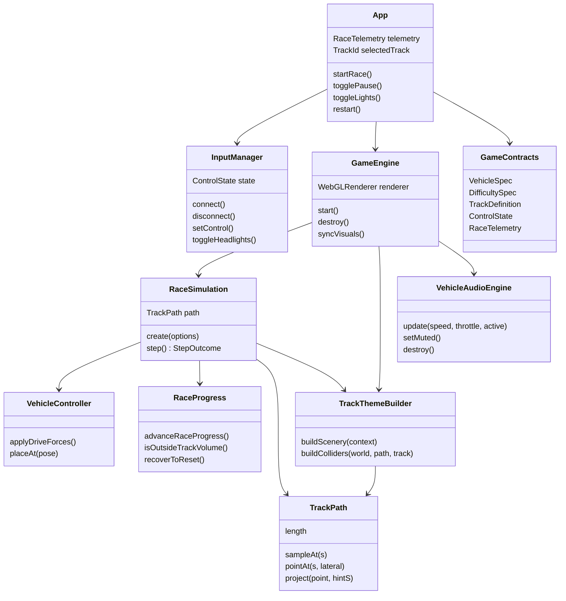
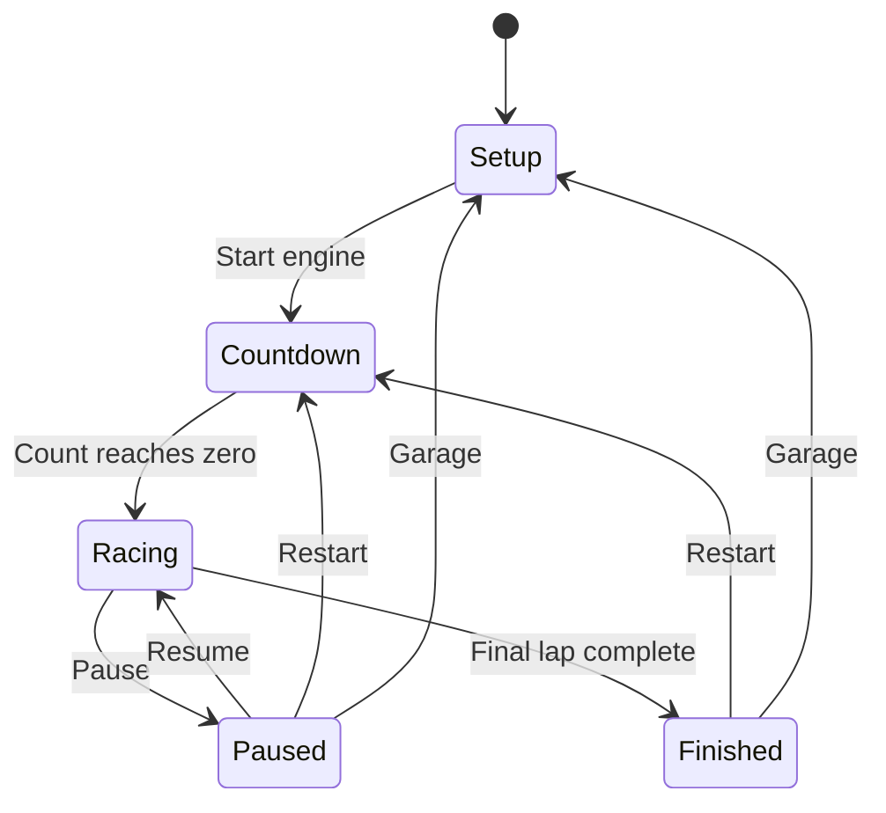
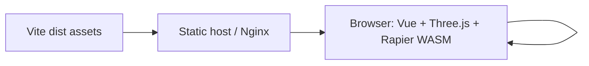
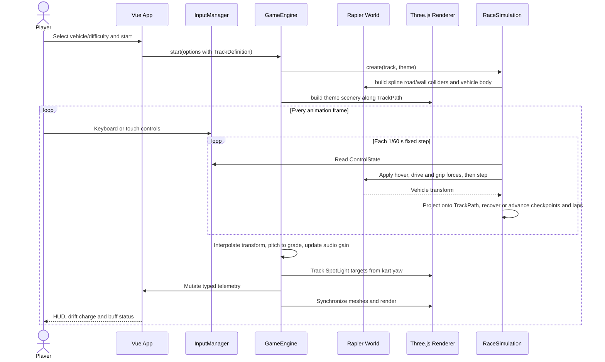

# Neon Drift Hong Kong Phase 1 Specifications

## Program Specification

### Structure

| Path | Responsibility |
| --- | --- |
| `src/App.vue` | Race setup (vehicle, driver class, circuit), HUD with lap and checkpoint progress, touch controls, pause and completion presentation |
| `src/types/game.ts` | Public game-state, vehicle, difficulty, leaderboard and `TrackDefinition` contracts |
| `src/config/gameConfig.ts` | Immutable vehicle and difficulty tuning data |
| `src/config/trackConfig.ts` | Selectable circuit catalogue |
| `src/config/tracks/hongKongRoute.ts` | Mong Kok sprint: open spline generated from the original S-curve, 3 checkpoints, 2 laps |
| `src/config/tracks/neonRift.ts` | Neon Rift layout: 1.6 km closed circuit with elevation, sunken tunnel chicane, viaduct crest, 12 hidden checkpoints, 5 laps |
| `src/game/InputManager.ts` | Keyboard and touch input boundary, including persistent headlight toggle state |
| `src/game/GameEngine.ts` | Rendering coordinator: renderer, camera, interpolation between fixed physics steps, vehicle pitch, headlight aiming, audio and resize lifecycle |
| `src/game/RaceSimulation.ts` | Headless Rapier race: track colliders, fixed-step vehicle physics, recovery, boost pads, checkpoint and lap progression |
| `src/game/raceProgress.ts` | Pure in-order checkpoint, anti-shortcut lap, closed-loop seam and recovery-point rules |
| `src/game/track/trackPath.ts` | Arc-length spline (`TrackPath`) with wrap-aware distances, lateral points and nearest-point projection |
| `src/game/track/trackStrip.ts` | Pure ribbon triangulation shared by road/wall meshes and trimesh colliders |
| `src/game/themes/*.ts` | Per-track scenery and collider builders (`hongKong`, `neonRift`) behind `TrackThemeBuilder` |
| `src/game/scene/trackMeshes.ts` | Strip mesh and chequered finish-line construction |
| `src/game/scene/hongKongStreetFurniture.ts` | Data-driven Hong Kong street details shared by both tracks: bilingual green gantry signs with route boxes, red-ringed speed-limit signs, white 慢駛 SLOW and lane-arrow road text, dashed lane lines, and zebra crossings with 望右/望左 kerb text and amber beacons |
| `src/game/physics/trackColliders.ts` | Trimesh strip and oriented box colliders with named surface responses |
| `src/game/vehicle/VehicleController.ts` | Hover, thrust, braking, steering, lateral grip and drift/mini-turbo forces on the Rapier body |
| `src/game/vehicle/handlingModel.ts` | Pure understeer yaw-rate cap, crest suspension unloading, spin trigger and braking-distance rules |
| `src/game/weatherModel.ts` | Pure weather-stage resolution (damp, storm, drying) and surface grip, braking and aquaplaning conditions |
| `src/game/ai/aiDriver.ts` | Pure AI rival controls, look-ahead and rubber-band pace factor |
| `src/game/track/racingLine.ts` | Racing-line lateral offsets and grip-aware target-speed profile shared by AI and drying-line grip |
| `src/game/standings.ts` | Live race order and gap calculation |
| `src/game/propDebris.ts`, `src/game/scene/propField.ts` | Visual-only destructible barrels and signs |
| `src/game/track/trackFeatures.ts` | Landmark positions, tunnel audio blend, zone and brake-warning rules |
| `src/game/scene/neonSetPieces.ts` | Neon Rift holo brake wall, warning lamps, reference pillars, kerbs and puddles |
| `src/game/scene/rainEffect.ts` | Storm rain streaks around the camera |
| `src/game/track/trackExport.ts`, `scripts/export-track-data.ts` | JSON export of checkpoint, corner and landmark coordinates to `docs/track-data/` |
| `docs/race_track.md` | Neon Rift design brief |
| `src/game/vehicle/vehicleFactory.ts` | FBX/GLB vehicle loading, procedural fallback bodies and tracked headlights |
| `src/game/VehicleAudioEngine.ts` | Web Audio MP3 graph lifecycle, smoothed playback updates and mute state |
| `src/game/audioModel.ts` | Pure vehicle-class playback-rate and gain calculation from speed, throttle and race activity |
| `src/game/audioModel.test.ts` | Vitest unit coverage for vehicle sound behavior |
| `public/audio/small-car-engine2.mp3` | User-provided 20.304-second looping vehicle engine sample used during driving |
| `public/models/taxi/HK_Taxi_Red.fbx` | Runtime FBX visual model for the playable red taxi |
| `public/models/minibus/HK_Minibus_Red.fbx` | Runtime FBX visual model with embedded textures for the playable red minibus |
| `public/models/double-decker/HK_Doubledeck_002.fbx` | Runtime FBX visual model with embedded textures for the playable double-decker bus |
| `public/models/tram/HK_Tram.fbx` | Original supplied tram FBX source model |
| `public/models/tram/HK_Tram.glb` | Indexed runtime tram asset optimized for GLTFLoader |
| `scripts/convert-tram.mjs` | Reproducible source conversion from the supplied FBX to runtime GLB |
| `public/ads/adv1.jpeg` | User-provided VitaGreen roadside advertisement texture |
| `public/ads/adv2.jpeg` | User-provided Deliveroo roadside advertisement texture |
| `public/ads/adv3.jpeg` | User-provided Lion Ball roadside advertisement texture |
| `src/game/physicsModel.ts` | Pure hover-force, track-volume recovery and sustained-drive model |
| `src/game/raceLogic.ts` | Pure drift, timing and ranking domain functions |
| `src/components/VehicleIcon.vue` | Reusable vehicle-class silhouette |
| `src/styles.css` | Responsive setup, HUD and touch-control presentation |
| `src/game/raceLogic.test.ts` | Vitest unit coverage for pure race rules |
| `src/game/physicsModel.test.ts` | Vitest smoke coverage for gravity compensation, sustained drive and track-volume containment |
| `src/game/hoverPhysics.integration.test.ts` | Rapier integration coverage for stable hover, momentum-preserving building impacts and hover over a sloped trimesh road |
| `src/game/raceSimulation.integration.test.ts` | Scripted-driver laps of Neon Rift and the Mong Kok sprint on real colliders without recovery |
| `src/game/raceProgress.test.ts` | Checkpoint ordering, shortcut rejection, seam crossing and recovery-point coverage |
| `src/game/track/trackPath.test.ts`, `trackStrip.test.ts` | Spline measurement, wrapping, projection and ribbon winding coverage |
| `src/config/trackConfig.test.ts` | Track catalogue integrity: checkpoint order, Mong Kok centreline parity, Neon Rift length, grade and non-overlap |
| `src/game/InputManager.test.ts` | Vitest coverage for headlight toggling and input reset semantics |
| `Dockerfile` | Reproducible Node build and minimal Nginx runtime image |
| `compose.yaml` | Hardened single-service runtime and health-check contract |
| `deployment/nginx.conf` | SPA fallback, immutable asset caching, WASM compression and health endpoint |
| `scripts/build.sh` | Locked install, tests, application build and container image build |
| `scripts/deploy.sh` | Validated Compose deployment with bounded readiness polling and diagnostics |

### Component Dependencies



### Public Contracts

Phase 1 is a client-only prototype and exposes no HTTP endpoints. Its public contracts are the TypeScript interfaces in `src/types/game.ts`. A future leaderboard backend should preserve `LeaderboardEntry` and wrap responses in a typed envelope with `code`, `message`, `data`, and `timestamp`.

`TrackDefinition` is the track data contract. Every distance `s` is metres along the spline centreline from the first control point; lateral offsets are metres to the right of travel. It is plain serialisable data so checkpoint and landmark coordinates can later be exported as JSON for the operations map.

| Field | Meaning |
| --- | --- |
| `closed` | `true` for circuits (laps continue across the seam), `false` for sprints (the vehicle returns to `startS` after each lap) |
| `controlPoints` | Centripetal Catmull-Rom control points `{x, y, z}` including elevation |
| `roadWidth`, `recoveryLateral` | Drivable width and the lateral distance beyond which the vehicle is recovered |
| `startS`, `finishS`, `checkpointS` | Grid, finish gate and hidden in-order checkpoint gates |
| `laps` | Laps required to finish |
| `boostPads`, `tunnels` | Seamless-buff sensors and covered ranges |

## Functional Specification

### Race Flow

1. The player selects one of four vehicle specifications, one of three difficulty specifications and one of two circuits.
2. Starting a race creates the `RaceSimulation` (Rapier world plus the circuit's colliders), then the Three.js scenery for the circuit's theme, then runs a three-count countdown.
3. When the red taxi, red minibus or double-decker is selected, the engine loads its matching FBX. The tram loads an indexed GLB generated from the supplied 20MB FBX because parsing its 759,009 unindexed vertices and four 4096px embedded images at race start stalls the browser. The conversion retains those four textures at a game-appropriate resolution in a single roughly 12MB GLB. Every format is normalized for orientation, scale, center and ground position. A loading failure falls back to the matching procedural vehicle without blocking the race.
4. During racing, `requestAnimationFrame` gathers elapsed time and advances `RaceSimulation.step()` at a fixed 60 Hz. Every track is a `TrackPath` spline; road meshes, trimesh road/wall colliders, scenery, checkpoints and recovery all address it by distance `s` and lateral offset, so visual and physical framing stay aligned. The vehicle pitches visually to the local grade.
5. Acceleration acts along kart heading, steering changes yaw, and lateral forces model grip.
6. Holding drift while steering above the minimum speed hops once and accumulates charge. Releasing applies the impulse assigned to the achieved drift stage.
7. Entering the fluorescent decal radius refreshes the Seamless timer to five seconds and minimizes lateral friction.
8. Building façades are represented by static Rapier cuboids with low friction and high restitution. Impacts therefore preserve horizontal momentum and rebound the selected vehicle instead of allowing it to pass through the city wall.
9. Every vehicle receives two front SpotLights. Pressing `L`, or the mobile LIGHTS control, toggles both lights. Their targets are updated each frame from the vehicle position and yaw so the beam follows steering.
10. The three supplied advertising textures are loaded before the race begins and placed on both roadside facades. Landscape and portrait source ratios are preserved, board order is freshly shuffled per side, and each board receives a warm point light.
11. A black-and-white 12-by-2 chequered marking spans the road at `finishS`. After each step the vehicle is projected onto the spline. Hidden checkpoints must be crossed forward and in order; crossing the finish only counts a lap once all of them are passed. Sprints return the vehicle to the grid after each lap, circuits continue across the seam. Exceeding the track's `laps` transitions to the finished state.
12. Neon Rift renders a dark wet road with magenta and cyan edge lines, glass barrier walls with colliders, a covered tunnel with amber lamp strips through the T7–T9 chicane, lit pillars under the viaduct, neon arches and an instanced tower canyon down to the city floor at y = -14. Towers keep a 30 m plaza clear around the Turn 3 brake wall.
13. Starting the race creates a filtered browser Web Audio graph and begins looping the supplied engine MP3 at zero race gain. Each rendered frame maps current speed and throttle to smoothed playback-rate and gain values, with lower base rates for heavier vehicles, and blends in tunnel gain and reverb near covered ranges. Countdown, pause and finish states target zero gain, while the HUD speaker button controls the master gain.
14. Three AI rivals join every race, never in the player's vehicle. Each follows the racing line toward a look-ahead point, targets the speed profile scaled by the square root of current grip, and adjusts pace up to ±6% depending on the gap to the player. Rivals stationary for 2.5 s are recovered; the player never is.
15. The weather follows the track's `weather` stages, keyed to the race leader's total distance. Weather, surface grip, aquaplaning, spin state and standings are published in `RaceTelemetry`.

### Neon Rift Gameplay Effects

| Feature | Location | Effect |
| --- | --- | --- |
| Turn 3 holo brake wall | Board 70 m beyond s = 345, active s = 250–365 | Board turns red when the braking distance to the corner speed, at 85% of the brake limit and scaled by weather braking, is reached |
| Glass barriers | Both road edges | Friction 0.2, restitution 0.35: contact costs speed rather than rebounding |
| Aqueduct tunnel | s = 705–955 | Engine gain up to +30% and reverb wet mix up to 0.85, faded over 18 m at each portal |
| T7–T9 warning lamps and kerbs | s = 755–860 | Lamps blink at 3 Hz. Kerb grip is 0.92 dry and 0.80 when wetness > 0.5 |
| Viaduct crest and pillars | T11–T14, s ≈ 1295–1435 | Suspension unloading up to 1 cuts grip by up to 65%. The blue second pillar at s = 1395 is the turn-in reference |
| Spin | Anywhere | Speed > 15 m/s, grip < 0.35 and requested yaw > 2.2× the cap for 250 ms spins the car for 900 ms |
| Weather: damp | Laps 1–2 | Grip 1.0, braking 1.0, wetness 0.35 |
| Weather: storm | Lap 3 from s = 535 | Grip 0.65, braking 0.83, rain and denser fog |
| Weather: drying | Laps 4–5 | On-line grip rises from 0.65 to 1.0 with dryness; off-line grip is 0.72–0.80; braking recovers to 1.0 |
| Aquaplaning | Puddles at s = 600, 1050, 1180, 1540 | Above 28 m/s while puddles stand (storm, or drying below 35% dryness): grip 0.1 |
| Destructible props | Barrels and signs at T3, chicane exit and T14 | Knocked into flight with bounce and spin. Visual only: the car's velocity is never changed |

Differences from `docs/race_track.md`: the brief specifies a 5.8 km lap, a lap time of about 1:42, a 1.2 km full-throttle viaduct straight and a tyre choice. The implementation is a 1.6 km prototype with no tyre selection.

### Validation and Boundaries

| Boundary | Rule |
| --- | --- |
| Vehicle selection | Must be one of `taxi`, `minibus`, `doubleDecker`, `tram` |
| Difficulty selection | Must be one of `learner`, `probationary`, `professional` |
| Physics frame | Browser frame delta is capped at 80 ms; simulation advances in 1/60-second increments |
| Speed display | Clamped to the HUD contract range of 0-200 km/h |
| Drift | Requires steering input and absolute forward speed above 4 m/s |
| Drift charge | Capped at 100; stage thresholds are 650, 1500 and 2400 ms |
| Seamless buff | Never negative; re-entering the sensor refreshes duration to 5000 ms |
| Input cleanup | Keyboard listeners, animation frame, resize listener and countdown timer are released on teardown |
| Headlights | `L` toggles both front SpotLights; the mobile LIGHTS button exposes the same state and telemetry reflects `headlightsOn` |
| Building collision | Static building colliders use restitution and low friction so impacts rebound with momentum; out-of-bounds recovery remains reserved for leaving the track volume |
| Road palette | Road and wet patches use a gray-white material palette for visibility against the night city |
| Track selection | Must be one of `hongKongRoute`, `neonRift` |
| Track geometry | `TrackPath` requires at least 2 (open) or 3 (closed) control points; samples every ~1 m by arc length; yaw follows the vehicle convention forward = (-sin yaw, 0, -cos yaw) |
| Projection | Nearest-point search runs in a ±60 m window around the previous `s`, falling back to a global search when the window's best match is more than 30 m away; height differences are weighted ×2 so stacked roads resolve to the correct level |
| Checkpoints | Gates count only when crossed forward in order within a single step of at most 25 m, so teleports and shortcuts never register |
| Finish line | The visual chequered line and lap gate share `finishS`; the first pass from the grid does not count because checkpoints are still outstanding |
| Recovery | Vehicle is recovered when more than 3 m below the road, beyond `recoveryLateral`, or past either end of an open sprint; it respawns at the last passed checkpoint (or the grid/finish at lap start) facing along the track |
| Advertising assets | `adv1.jpeg`, `adv2.jpeg` and `adv3.jpeg` are loaded from `/ads/`, preserve source aspect ratio and render uncropped on the track-facing face of illuminated boards |
| Vehicle audio | The supplied MP3 loops continuously; speed is clamped to the 0-180 km/h sound model range; non-racing phases output zero sample gain; mute changes only the master gain |

### State Transitions



### Error Recovery

WebGL or WASM initialization failures reject `GameEngine.start()` and remain visible in the browser console during Phase 1. Normal user recovery is a page reload. `RaceSimulation` restores the vehicle to the last passed checkpoint if it leaves the supported track volume, and reports the step as `recovered` so the renderer skips interpolation across the jump. A production phase should add a typed initialization-error state and a non-WebGL compatibility screen.

## Infrastructure and Deployment Topology

### Runtime

- Node.js 20 or newer; verified with Node.js 26.
- npm 11 or newer.
- Modern browser with WebGL2 and WebAssembly.
- `ffmpeg` is needed only when regenerating the optimized tram GLB with `npm run convert:tram`.
- Production output is emitted to `dist/` by Vite.
- No database or connection pool is used in Phase 1. Redis leaderboard integration remains future scope.
- No secrets are required. Deployment variables are optional and validated by the scripts.

| Variable | Default | Purpose |
| --- | --- | --- |
| `IMAGE_REPOSITORY` | `neon-drift-hk` | Local or registry-backed container repository |
| `IMAGE_TAG` | `latest` | Container image version |
| `CONTAINER_NAME` | `neon-drift-hk` | Runtime container name |
| `APP_PORT` | `8080` | Published host port |
| `COMPOSE_PROJECT_NAME` | `neon-drift-hk` | Isolates Compose-managed resources |
| `HEALTH_RETRIES` | `30` | One-second readiness attempts before deployment failure |



### Build and Deploy

Build and validate both the SPA and its image:

```bash
npm run build:image
```

Rebuild the image from the current source, deploy locally and wait for the Nginx health endpoint:

```bash
npm run deploy
```

Redeploy the existing image without rebuilding:

```bash
SKIP_BUILD=1 npm run deploy
```

Deploy an explicitly versioned image on another port:

```bash
IMAGE_REPOSITORY=registry.example.com/neon-drift-hk IMAGE_TAG=1.0.0 APP_PORT=8088 npm run build:image
IMAGE_REPOSITORY=registry.example.com/neon-drift-hk IMAGE_TAG=1.0.0 APP_PORT=8088 npm run deploy
```

Nginx serves hashed Vite assets with immutable one-year caching, prevents caching of the SPA entry point, exposes `/healthz`, provides history fallback, and includes the standard `application/wasm` MIME mapping required by Rapier.

## End-to-End Sequence



## Testing Document

### Unit Tests

Vitest tests use Arrange-Act-Assert semantics and exercise domain functions independently from WebGL. Current coverage includes all drift stage boundaries, charge capping, turbo scaling, time formatting, immutable leaderboard sorting, mass-scaled gravity compensation, sustained 15-second forward motion, track-volume recovery, headlight input state transitions and vehicle audio pitch/gain rules.

Run:

```bash
npm run test
```

### Functional and Integration Test Matrix

| Test Case ID | Scenario | Preconditions | Input Payload | Expected Status & Response | Pass/Fail Criteria |
| --- | --- | --- | --- | --- | --- |
| UNIT-001 | Drift thresholds | Test runtime available | 0, 650, 1500, 2400 ms | Stages 0, 1, 2, 3 | Exact threshold assertions pass |
| UNIT-002 | Drift cap and boost | Test runtime available | 5000 ms, stages 2 and 3 | Charge 100; stage 3 impulse greater | Assertions pass |
| UNIT-003 | Race formatting/ranking | Unsorted entries | 65430 ms and two times | `1:05.43`; lower time first | Assertions pass without mutating input |
| UNIT-004 | Headlight input state | New InputManager | Toggle then reset | Headlight state toggles and survives transient input reset | Assertions pass |
| UNIT-006 | Track path maths | Test runtime available | Straight, open and closed square paths | Arc length, clamping/wrapping, seam continuity, right-hand lateral offsets and global fallback projection | Assertions pass |
| UNIT-007 | Checkpoint ordering | Closed 1000 m loop and open sprint layouts | Stepwise driving, a 640 m shortcut, seam crossings | Laps only after all gates; shortcut leaves lap at 1; reset point follows last gate | Assertions pass |
| UNIT-008 | Track catalogue integrity | Both definitions | Spline sampling | Ordered checkpoints; Mong Kok stays within 5 cm of the legacy centreline; Neon Rift 1.5–1.7 km, grade < 12%, non-adjacent sections > 32 m apart | Assertions pass |
| INT-001 | Sloped trimesh hover | Rapier initialised | Ramp strip collider, 10 s hover | Clearance settles at the hover height | Within 0.05 m |
| INT-002 | Scripted lap drivability | Rapier initialised | Look-ahead autopilot, taxi, Professional | Neon Rift and Mong Kok finish one lap with zero recoveries and all checkpoints | Neon Rift lap 25–150 s (currently 74 s) |
| UNIT-009 | Weather and surface | Test runtime available | Stage list, progress, puddle, kerb, speed | Damp/storm/drying resolution; storm grip 0.65 and braking 0.83; aquaplaning only above 28 m/s in standing water; drying racing line out-grips off-line | Assertions pass |
| UNIT-010 | Handling limits | Test runtime available | Speed, grip, ray distance, yaw request | Yaw cap falls with speed and grip; crest unloading reduces grip; sustained overdrive on low grip triggers a 900 ms spin | Assertions pass |
| UNIT-011 | AI and standings | Test runtime available | Heading error, speed, gap; race progress | Binary steering and throttle choices; rubber band within ±6%; standings ordered by lap and distance | Assertions pass |
| UNIT-012 | Prop debris | Test runtime available | Car position and velocity near a prop | Prop launches, bounces and comes to rest; car velocity input is unchanged | Assertions pass |
| INT-003 | Rival field | Rapier initialised | Neon Rift, three rivals, including a full storm lap | Rivals finish cleanly without recovery; standings stay consistent | Assertions pass |
| FUNC-022 | Storm and aquaplaning | Neon Rift, lap 3 past s = 535 | Drive through a puddle above 100 km/h | Rain visible, HUD weather shows storm, grip drops, `水漂 AQUAPLANING` banner | Banner shows only at speed in the puddle |
| FUNC-023 | Turn 3 brake board | Neon Rift race active | Approach Turn 3 at full speed | Board turns red at the braking point | Board returns to normal after braking or passing |
| FUNC-024 | Tunnel audio | Neon Rift, sound on | Drive through s = 705–955 | Engine louder with reverb inside, clean on exit | Audible change fades over the portals |
| FUNC-019 | Circuit selection | Setup visible | Choose Neon Rift, start | HUD shows `1/5` and `CP 0/12`; neon scenery renders | Start bar shows `HARBOUR VIADUCT CIRCUIT` |
| FUNC-020 | Closed-circuit lap | Neon Rift race active | Drive a full lap through all checkpoints | Lap counter advances without teleporting to the grid | `CP` resets to 0 and lap increments at the finish gate |
| FUNC-021 | Anti-shortcut | Neon Rift race active | Leave the track and rejoin further along | Vehicle recovers to the last passed checkpoint; skipped gates are not credited | Lap does not increment |
| UNIT-005 | Vehicle sound mapping | Test runtime available | Vehicle, speed, throttle and race-active state | Driving raises sample rate/gain; heavy vehicles use a lower base rate; inactive race is silent | Exact playback-rate and gain relationships pass |
| FUNC-001 | Start default race | Setup visible | Taxi, Probationary | Countdown then active HUD | Canvas renders; phase becomes racing |
| FUNC-002 | Vehicle tuning | Setup visible | Each vehicle option | Stats and kart form update | Selected contract reaches engine |
| FUNC-003 | Accelerate and steer | Race active | W plus A/D | Speed rises and heading changes | HUD and kart movement respond |
| FUNC-004 | Drift mini-turbo | Moving above 4 m/s | Space plus turn, then release | Hop, charge, stronger release impulse | Stage and speed feedback observable |
| FUNC-005 | Seamless decal | Race active near decal | Drive through cyan sensor | Buff shows 5.0 seconds and counts down | Timer is visible and friction reduced |
| FUNC-006 | Pause/resume | Race active | Pause then Resume | Simulation and timer stop, then continue | No input remains stuck |
| FUNC-007 | Lap completion | Race active | Cross the visible black-and-white finish line twice | Finished modal with race time | Chequered line spans the road and phase is `finished` after the final crossing |
| FUNC-008 | Mobile controls | Viewport at or below 760 px | Touch steering, gas and drift | Touch controls manipulate shared state | No HUD overlap; controls release on pointer up/leave |
| BUILD-001 | Production bundle | Dependencies installed | `npm run build` | Exit code 0 and `dist/` output | Type check and Vite build succeed |
| BUILD-002 | Container image | Docker daemon available | `npm run build:image` | Tests/build pass and tagged image exists | Script exits 0; image inspection succeeds |
| FUNC-009 | FBX taxi visual | Taxi selected and model asset available | Start race | FBX model is normalized in a world-space heading wrapper and attached to the physics-driven kart group | Model request returns 200; the roof faces upward and the taxi remains aligned with the collider |
| FUNC-010 | FBX minibus visual | Minibus selected and model asset available | Start race | Textured FBX model is normalized in a world-space heading wrapper and attached to the physics-driven kart group | Model request returns 200; the roof faces upward and the minibus remains aligned with the collider |
| FUNC-011 | FBX double-decker visual | Double-decker selected and model asset available | Start race | Textured FBX model is normalized in a world-space heading wrapper and attached to the physics-driven kart group | Model request returns 200; the roof faces upward and the bus remains aligned with the collider |
| FUNC-017 | Tram model visual | Tram selected and optimized model asset available | Start race | GLTFLoader loads the converted supplied model, then normalization attaches it to the physics-driven kart group | GLB request returns 200; the tram roof faces upward, remains aligned with the collider and does not block the countdown |
| FUNC-012 | Building impact momentum | Race active and vehicle inside track bounds | Accelerate and steer into a building façade | Static collider blocks the vehicle and returns a measurable rebound velocity | Vehicle does not teleport to the start; post-impact motion is visible and the run remains active |
| FUNC-013 | Headlight toggle and tracking | Race active | Press `L` twice or tap mobile LIGHTS | Both front SpotLights switch OFF then ON and telemetry label follows | HUD label changes; beam remains aimed along current vehicle heading after steering |
| FUNC-014 | Gray-white road palette | Race active | Inspect rendered track | Road and wet patches render in gray-white tones | Main road is visibly lighter than the dark buildings and preserves patch contrast |
| FUNC-016 | Curved race track | Race active | Accelerate through the route | Centerline and roadside scene bend through multiple turns | Lane markings, barriers and buildings follow the same heading without visible scene shearing |
| FUNC-015 | Roadside advertisements | Race active and `/ads/` assets available | Drive past both sides of the track | Textured advertising boards appear on left and right facades in a mixed sequence | All three supplied images are requested successfully, show their full uncropped image and do not cover the driving lane |
| FUNC-018 | Vehicle driving audio | Race active in an audio-enabled browser and `/audio/small-car-engine2.mp3` available | Hold W/GAS, release, pause, resume, then toggle the speaker button | Supplied MP3 loops; pitch and volume rise with motion, fade when paused, resume with racing and follow mute state | MP3 request returns 200; audio is audible only when unmuted and racing; UI `aria-pressed` matches mute state |
| DEPLOY-001 | Healthy local deployment | Built image and free host port | `npm run deploy` | Compose service becomes healthy | `/healthz` returns HTTP 200 within retry limit |
| DEPLOY-002 | Invalid port rejected | Shell available | `APP_PORT=invalid npm run deploy` | Validation error; no deployment mutation | Script exits 2 before Docker Compose runs |

### Remaining Test Scope

Phase 1 does not yet include browser-level automated WebGL assertions or a Redis-backed integration environment. Those should be added alongside the leaderboard API rather than mocked into the client-only prototype.
