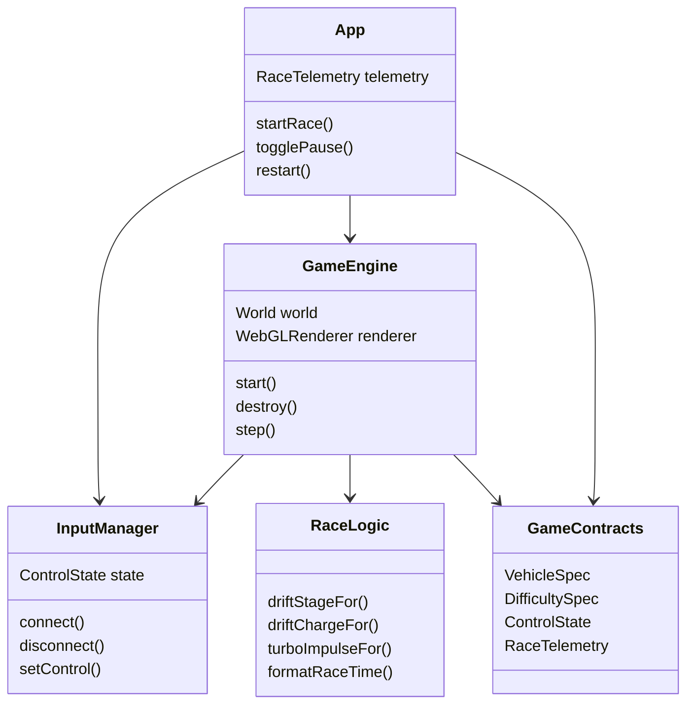
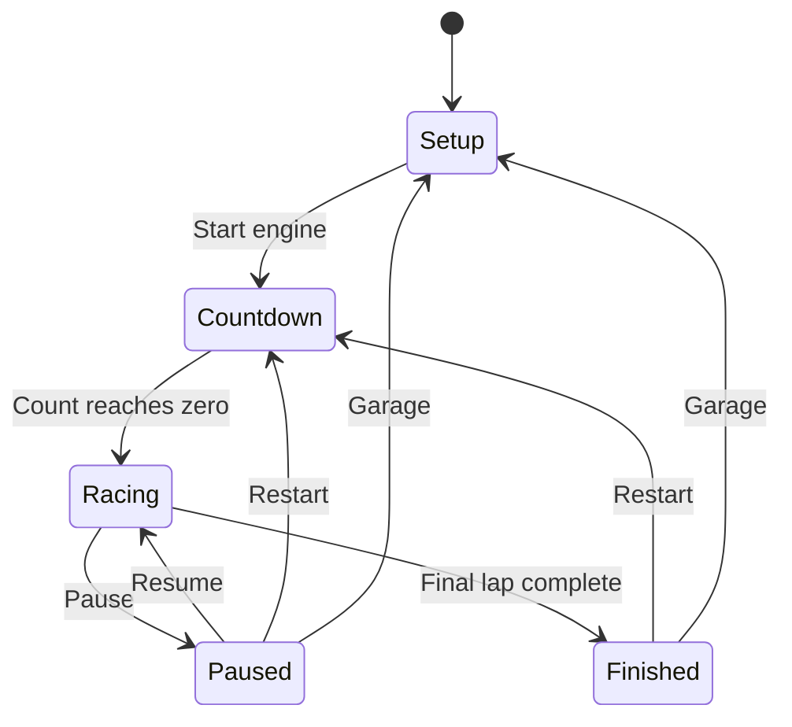
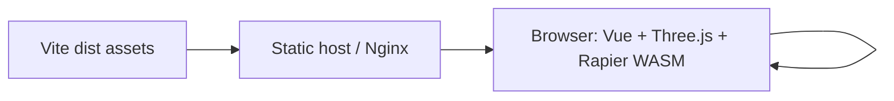
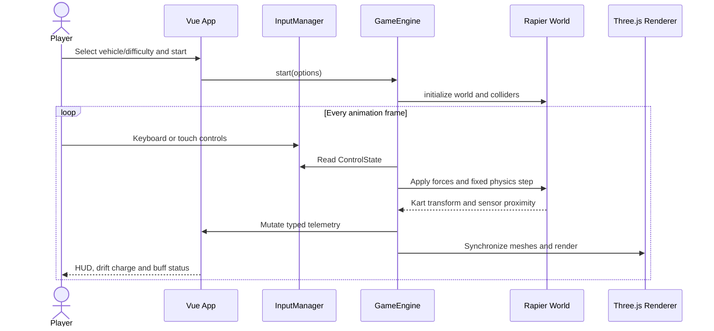

# Neon Drift Hong Kong Phase 1 Specifications

## Program Specification

### Structure

| Path | Responsibility |
| --- | --- |
| `src/App.vue` | Race setup, HUD, touch controls, pause and completion presentation |
| `src/types/game.ts` | Public game-state, vehicle, difficulty and leaderboard contracts |
| `src/config/gameConfig.ts` | Immutable vehicle and difficulty tuning data |
| `src/game/InputManager.ts` | Keyboard and touch input boundary |
| `src/game/GameEngine.ts` | Three.js scene, Rapier world, fixed-step simulation and race lifecycle |
| `public/models/taxi/HK_Taxi_Red.fbx` | Runtime FBX visual model for the playable red taxi |
| `public/models/minibus/HK_Minibus_Red.fbx` | Runtime FBX visual model with embedded textures for the playable red minibus |
| `public/models/double-decker/HK_Doubledeck_002.fbx` | Runtime FBX visual model with embedded textures for the playable double-decker bus |
| `src/game/physicsModel.ts` | Pure hover-force, track-volume recovery and sustained-drive model |
| `src/game/raceLogic.ts` | Pure drift, timing and ranking domain functions |
| `src/components/VehicleIcon.vue` | Reusable vehicle-class silhouette |
| `src/styles.css` | Responsive setup, HUD and touch-control presentation |
| `src/game/raceLogic.test.ts` | Vitest unit coverage for pure race rules |
| `src/game/physicsModel.test.ts` | Vitest smoke coverage for gravity compensation, sustained drive and recovery |
| `Dockerfile` | Reproducible Node build and minimal Nginx runtime image |
| `compose.yaml` | Hardened single-service runtime and health-check contract |
| `deployment/nginx.conf` | SPA fallback, immutable asset caching, WASM compression and health endpoint |
| `scripts/build.sh` | Locked install, tests, application build and container image build |
| `scripts/deploy.sh` | Validated Compose deployment with bounded readiness polling and diagnostics |

### Component Dependencies



### Public Contracts

Phase 1 is a client-only prototype and exposes no HTTP endpoints. Its public contracts are the TypeScript interfaces in `src/types/game.ts`. A future leaderboard backend should preserve `LeaderboardEntry` and wrap responses in a typed envelope with `code`, `message`, `data`, and `timestamp`.

## Functional Specification

### Race Flow

1. The player selects one of four vehicle specifications and one of three difficulty specifications.
2. Starting a race creates the Three.js scene and Rapier world, then runs a three-count countdown.
3. When the red taxi, red minibus or double-decker is selected, the engine loads its matching FBX, normalizes its orientation, scale, center and ground position, and retains its embedded FBX materials. A loading failure falls back to the matching procedural vehicle without blocking the race.
4. During racing, `requestAnimationFrame` gathers elapsed time and advances Rapier at a fixed 60 Hz step.
5. Acceleration acts along kart heading, steering changes yaw, and lateral forces model grip.
6. Holding drift while steering above the minimum speed hops once and accumulates charge. Releasing applies the impulse assigned to the achieved drift stage.
7. Entering the fluorescent decal radius refreshes the Seamless timer to five seconds and minimizes lateral friction.
8. Crossing the finish plane resets the kart for the next lap. Completing two laps transitions to the finished state.

### Validation and Boundaries

| Boundary | Rule |
| --- | --- |
| Vehicle selection | Must be one of `taxi`, `minibus`, `doubleDecker`, `tram` |
| Difficulty selection | Must be one of `learner`, `probationary`, `professional` |
| Physics frame | Browser frame delta is capped at 80 ms; simulation advances in 1/60-second increments |
| Speed display | Clamped to the HUD contract range of 0-200 km/h |
| Drift | Requires steering input and absolute forward speed above 4 m/s |
| Drift charge | Capped at 100; stage thresholds are 650, 1500 and 2400 ms |
| Seamless buff | Never negative; re-entering the sensor refreshes duration to 5000 ms |
| Input cleanup | Keyboard listeners, animation frame, resize listener and countdown timer are released on teardown |

### State Transitions



### Error Recovery

WebGL or WASM initialization failures reject `GameEngine.start()` and remain visible in the browser console during Phase 1. Normal user recovery is a page reload. The physics controller restores the kart to the last race reset point if it leaves the supported track volume. A production phase should add a typed initialization-error state and a non-WebGL compatibility screen.

## Infrastructure and Deployment Topology

### Runtime

- Node.js 20 or newer; verified with Node.js 26.
- npm 11 or newer.
- Modern browser with WebGL2 and WebAssembly.
- Production output is emitted to `dist/` by Vite.
- No database or connection pool is used in Phase 1. Redis leaderboard integration remains future scope.
- No secrets are required. Deployment variables are optional and validated by the scripts.

| Variable | Default | Purpose |
| --- | --- | --- |
| `IMAGE_REPOSITORY` | `neon-drift-hk` | Local or registry-backed container repository |
| `IMAGE_TAG` | `latest` | Container image version |
| `CONTAINER_NAME` | `neon-drift-hk` | Runtime container name |
| `APP_PORT` | `8080` | Published host port |
| `COMPOSE_PROJECT_NAME` | `neon-drift-hk` | Isolates Compose-managed resources |
| `HEALTH_RETRIES` | `30` | One-second readiness attempts before deployment failure |



### Build and Deploy

Build and validate both the SPA and its image:

```bash
npm run build:image
```

Deploy locally and wait for the Nginx health endpoint:

```bash
npm run deploy
```

Deploy an explicitly versioned image on another port:

```bash
IMAGE_REPOSITORY=registry.example.com/neon-drift-hk IMAGE_TAG=1.0.0 APP_PORT=8088 npm run build:image
IMAGE_REPOSITORY=registry.example.com/neon-drift-hk IMAGE_TAG=1.0.0 APP_PORT=8088 npm run deploy
```

Nginx serves hashed Vite assets with immutable one-year caching, prevents caching of the SPA entry point, exposes `/healthz`, provides history fallback, and includes the standard `application/wasm` MIME mapping required by Rapier.

## End-to-End Sequence



## Testing Document

### Unit Tests

Vitest tests use Arrange-Act-Assert semantics and exercise domain functions independently from WebGL. Current coverage includes all drift stage boundaries, charge capping, turbo scaling, time formatting, immutable leaderboard sorting, mass-scaled gravity compensation, sustained 15-second forward motion and track-volume recovery.

Run:

```bash
npm run test
```

### Functional and Integration Test Matrix

| Test Case ID | Scenario | Preconditions | Input Payload | Expected Status & Response | Pass/Fail Criteria |
| --- | --- | --- | --- | --- | --- |
| UNIT-001 | Drift thresholds | Test runtime available | 0, 650, 1500, 2400 ms | Stages 0, 1, 2, 3 | Exact threshold assertions pass |
| UNIT-002 | Drift cap and boost | Test runtime available | 5000 ms, stages 2 and 3 | Charge 100; stage 3 impulse greater | Assertions pass |
| UNIT-003 | Race formatting/ranking | Unsorted entries | 65430 ms and two times | `1:05.43`; lower time first | Assertions pass without mutating input |
| FUNC-001 | Start default race | Setup visible | Taxi, Probationary | Countdown then active HUD | Canvas renders; phase becomes racing |
| FUNC-002 | Vehicle tuning | Setup visible | Each vehicle option | Stats and kart form update | Selected contract reaches engine |
| FUNC-003 | Accelerate and steer | Race active | W plus A/D | Speed rises and heading changes | HUD and kart movement respond |
| FUNC-004 | Drift mini-turbo | Moving above 4 m/s | Space plus turn, then release | Hop, charge, stronger release impulse | Stage and speed feedback observable |
| FUNC-005 | Seamless decal | Race active near decal | Drive through cyan sensor | Buff shows 5.0 seconds and counts down | Timer is visible and friction reduced |
| FUNC-006 | Pause/resume | Race active | Pause then Resume | Simulation and timer stop, then continue | No input remains stuck |
| FUNC-007 | Lap completion | Race active | Cross finish plane twice | Finished modal with race time | Phase is `finished` after final lap |
| FUNC-008 | Mobile controls | Viewport at or below 760 px | Touch steering, gas and drift | Touch controls manipulate shared state | No HUD overlap; controls release on pointer up/leave |
| BUILD-001 | Production bundle | Dependencies installed | `npm run build` | Exit code 0 and `dist/` output | Type check and Vite build succeed |
| BUILD-002 | Container image | Docker daemon available | `npm run build:image` | Tests/build pass and tagged image exists | Script exits 0; image inspection succeeds |
| FUNC-009 | FBX taxi visual | Taxi selected and model asset available | Start race | FBX model is normalized in a world-space heading wrapper and attached to the physics-driven kart group | Model request returns 200; the roof faces upward and the taxi remains aligned with the collider |
| FUNC-010 | FBX minibus visual | Minibus selected and model asset available | Start race | Textured FBX model is normalized in a world-space heading wrapper and attached to the physics-driven kart group | Model request returns 200; the roof faces upward and the minibus remains aligned with the collider |
| FUNC-011 | FBX double-decker visual | Double-decker selected and model asset available | Start race | Textured FBX model is normalized in a world-space heading wrapper and attached to the physics-driven kart group | Model request returns 200; the roof faces upward and the bus remains aligned with the collider |
| DEPLOY-001 | Healthy local deployment | Built image and free host port | `npm run deploy` | Compose service becomes healthy | `/healthz` returns HTTP 200 within retry limit |
| DEPLOY-002 | Invalid port rejected | Shell available | `APP_PORT=invalid npm run deploy` | Validation error; no deployment mutation | Script exits 2 before Docker Compose runs |

### Remaining Test Scope

Phase 1 does not yet include browser-level automated WebGL assertions or a Redis-backed integration environment. Those should be added alongside the leaderboard API rather than mocked into the client-only prototype.
